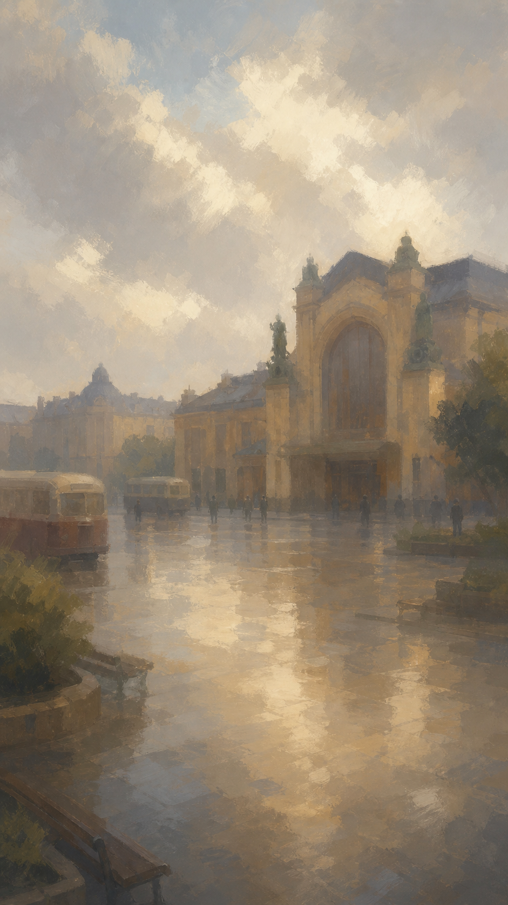
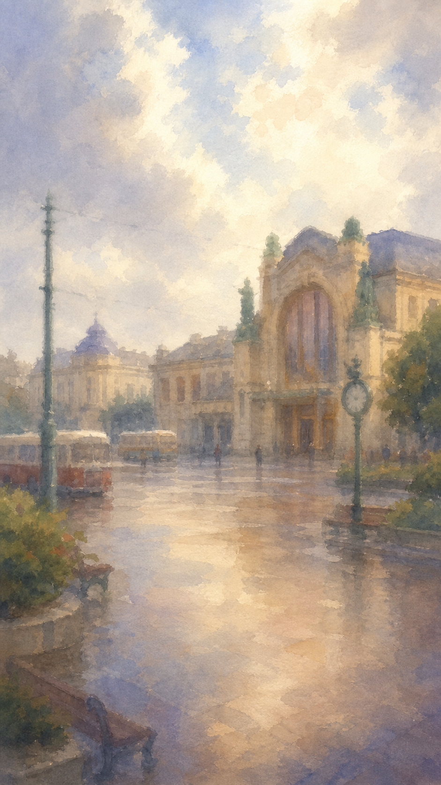
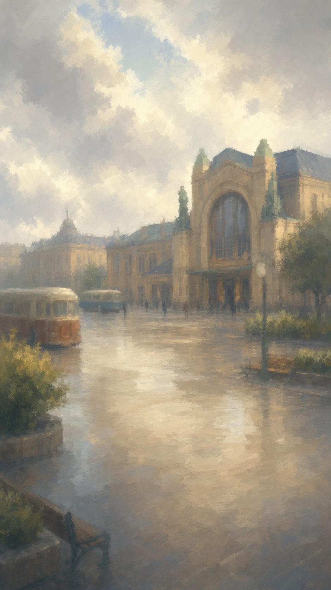
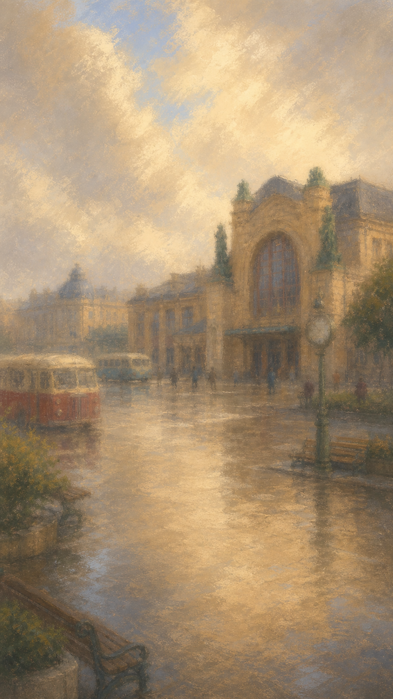

# Тест мягкого рисованного фона: вокзальная площадь

Статус: **ожидает выбора пользователя**.

Источник композиции: `assets/backgrounds/riverside_station_square_day.png`.

Цель теста — выбрать художественный язык всех городских окружений. Эти изображения являются сравнительными концептами и пока не подключены к игре. Исходный рабочий фон не заменён.

## Общие ограничения

- фон рассматривается как атмосферная подложка под UI, а не самостоятельная иллюстрация для разглядывания;
- место должно узнаваться примерно на ширине 120 пикселей по силуэту вокзала, открытому пространству, свету и цветовым массам;
- мелкая архитектура, провода, лица, кладка и фактура транспорта намеренно растворены;
- низкая резкость создаётся самим способом рисования, а не дешёвым blur-фильтром поверх фотографии;
- в финальном производстве время, погода, психика и наблюдаемые изменения мира по-прежнему накладываются поверх одного базового изображения.

## Запись генерации

Инструмент: встроенный `image_gen`, режим редактирования `style-transfer`. Целевым изображением во всех четырёх вызовах был один и тот же `riverside_station_square_day.png`.

Общая часть финального prompt-набора:

> Very soft portrait mobile-game location background for a fictional city in 1980. Retain only the broad identity and layout of the source: bright clouded sky, station mass on the right, open wet square below, dark transport and greenery accents. Design for recognition at roughly 120 pixels wide. Reduce the scene to a few large tonal and color masses; dissolve masonry, wires, faces, vehicles and minor figures into painterly marks. Very low microcontrast and high-frequency detail. Clearly hand-drawn or hand-painted, aesthetically finished rather than merely blurred, with no text, UI, logos, flags, modern objects or watermark.

Стилевые окончания четырёх prompts:

- **A:** opaque gouache, broad flat and dry brushes, matte pigment, softened edges;
- **B:** wet-on-wet watercolor, blooming washes, granulation, almost no hard boundary;
- **C:** impressionistic painting, broad soft brush masses, broken color, hazy atmospheric depth;
- **D:** soft pastel and powdered charcoal on toned paper, rubbed color fields and smudged transitions.

## Кандидаты

### A — Очень мягкая гуашь

Матовая, спокойная и наиболее близкая к реалистичной среде. Широкие мазки сохраняют материальность города, но почти убирают микродеталь.

### B — Акварель по мокрой бумаге

Самая воздушная и светлая версия. Хорошо растворяет фон, но бумажная фактура и светлая палитра могут сильнее менять характер разных районов.

### C — Мягкая импрессионистическая живопись

Самый нейтральный кандидат для массового производства: крупные световые пятна, узнаваемая локация и достаточно спокойный фон для UI.

### D — Растушёванная пастель

Наиболее тёплая и фактурная версия. Даёт выраженную авторскую интонацию, но зерно пастели может спорить с некоторыми психическими и погодными фильтрами.

## После выбора

Выбранный вариант превращается в точный производственный стандарт: палитра, размер мазка, допустимая детализация, контраст, края, зерно и правила генерации. Затем в этом стандарте перерисовывается один контрастный фон — подземный переход. Только после проверки светлой площади и тёмного перехода стиль распространяется на остальные локации.
